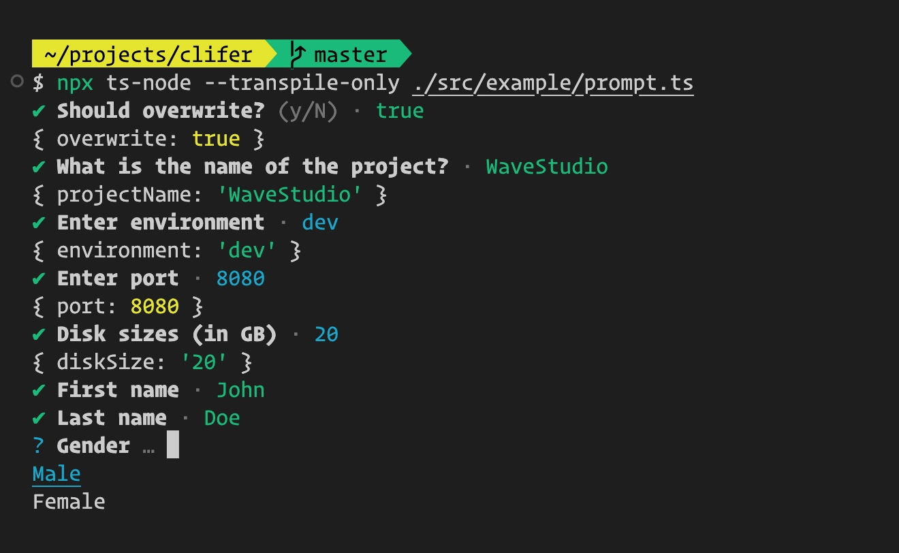

# Clifer

[](https://github.com/semantic-release/semantic-release)

A lightweight library for building beautiful command-line interfaces for NodeJS applications.

## Install

### Yarn

```sh
yarn add clifer
```

### NPM

```sh
npm install clifer
```

## Usage

Create `src/cli.ts` with the following content:

```ts
import { cli, input, runCli } from 'clifer'

enum Type {
  api = 'api',
  subscriber = 'subscriber',
}

interface Props {
  service: string
  instances?: number
  type?: Type
  dryRun?: boolean
}

function run(props: Props) {
  // Handle the action here
  console.log({ props })
}

const program = cli<Props>('create-model')
  // Add an option '--version' to the version of the CLI
  .version('1.0')

  // Add a positional input of type string and prompt if not provided
  .argument(input('name').description('Name of the model').string().required().prompt())

  // Add --service=<string>
  .option(input('service').description('Name of the service').string().required())

  // Add --instances=<number>
  .option(input('instances').description('Number of instances').number().default(2))

  // Add --type=[api|subscriber]
  .option(
    input('type').description('Type of the model').string().options([Type.api, Type.subscriber]),
  )

  // Add --dry-run flag
  .option(input('dryRun').description('Perform a dry run'))

  // Load values from an external source or at runtime (e.g., from a file)
  .load(async (props: Partial<T>) => readJSONAsync('./env.json'))

  // Handle the command
  .handle(run)

runCli(program).catch(e => console.error(e))
```

## Configure Project

To make an npm package executable, follow these steps:

1. **Add a `bin` field to `package.json`:** This field specifies the executable files and the
   command names.
2. **Create the executable file:** The file should start with a shebang (`#!`) that specifies the
   path to the Node.js executable.
3. **Ensure the file has execute permissions:** Make the file executable by setting the correct
   permissions.

Here's a step-by-step guide:

### Step 1: Add `bin` Field to `package.json`

In your `package.json`, add a `bin` field that maps command names to executable files. For example:

```json
{
  "name": "your-package-name",
  "version": "1.0.0",
  "bin": {
    "your-command": "bin/cli"
  },
  ...
}
```

### Step 2: Create the Executable File

Create the executable JavaScript file (`bin/cli`) and start it with a shebang:

```javascript
#!/usr/bin/env node

const { spawn } = require('child_process')
const { resolve } = require('path')
const cli = resolve(__dirname, '..', 'dist', 'cli.js')
const args = process.argv.slice(2).join(' ')
const cmd = `${cli} ${args}`
const child = spawn('node', cmd.split(' '), {
  detached: false,
  stdio: 'inherit',
  cwd: process.cwd(),
})
child.on('exit', function (code, signal) {
  process.exit(code)
})
```

### Step 3: Ensure the File has Execute Permissions

Make the file executable by setting the correct permissions. Run the following command in your
terminal:

```sh
chmod +x bin/cli
```

### Step 4: Install the Package Globally (Optional)

If you want to test the command globally, you can install your package globally:

```sh
npm install -g .
```

### Step 5: Run Your Command

After following the above steps, you should be able to run your command from the terminal:

```sh
your-command
```

### Testing the Package Locally

Instead of installing globally, you can also link the package locally for testing:

```sh
npm link
```

Now you can run the `your-command` command:

```sh
your-command
```

By following these steps, you can make your npm package executable and create your own command-line
tools.

## Auto-Generated Help


## Commands

```ts
import { cli, command, input, runCli } from 'clifer'

enum Type {
  ts = 'ts',
  js = 'js',
}

interface Props {
  dryRun?: boolean
}

interface CreateCommandProps {
  name: string
  type?: Type
}

interface IndexCommandProps {
  name: string
  publish?: boolean
}

const createModel = command<CreateCommandProps>('model')
  .description('Create a model')
  .argument(input('name').description('Name of the model').string().required())
  .option(input('type').description('Type of the model').string().options([Type.ts, Type.js]))
  .handle((props: CreateCommandProps) => {
    // Handle action
  })

const createRepository = command<CreateCommandProps>('repository')
  .description('Create a repository')
  .argument(input('name').description('Name of the repository').string().required())
  .option(input('type').description('Type of the repository').string().options([Type.ts, Type.js]))
  .handle((props: CreateCommandProps) => {
    // Handle action
  })

const createSchema = command<CreateCommandProps>('schema')
  .description('Create a schema file')
  .argument(input('name').description('Name of the schema').string().required())
  .option(input('type').description('Type of the schema').string().options([Type.ts, Type.js]))
  .handle((props: CreateCommandProps) => {
    // Handle action
  })

const createCommand = command('create')
  .description('Create backend modules')
  .command(createModel)
  .command(createRepository)
  .command(createSchema)

const indexCommand = command<IndexCommandProps>('index')
  .description('Create database index')
  .argument(input('name').description('Name of the file to create').string().required())
  .option(input('publish').description('Publish the index'))
  .handle((props: IndexCommandProps) => {
    // Handle action
  })

const program = cli<Props>('builder')
  .version('1.0')
  .command(createCommand)
  .command(indexCommand)
  .option(input('dryRun').description('Execute a sample run'))

runCli(program).catch((e: any) => console.error(e))
```


## Use Prompt

```ts
import { input, prompt } from 'clifer'

// Yes/No confirmation
const { overwrite } = await prompt(
  input('overwrite').description('Overwrite existing files?').prompt('Should overwrite?'),
)
console.log({ overwrite })

// String prompt
const { projectName } = await prompt(
  input('projectName')
    .description('Name of the project')
    .string()
    .prompt('What is the name of the project?'),
)
console.log({ projectName })

// String prompt with auto-complete
const { environment } = await prompt(
  input('environment')
    .description('Environment')
    .string()
    .prompt('Enter environment')
    .choices(['local', 'dev', 'prod']),
)
console.log({ environment })

// Number prompt
const { port } = await prompt(
  input('port').description('Server port').number().prompt('Enter port'),
)
console.log({ port })

// Number prompt with choices
const { diskSize } = await prompt(
  input('diskSize')
    .description('Disk size to use the cloud')
    .number()
    .choices([10, 20, 50, 100])
    .prompt('Disk sizes (in GB)'),
)
console.log({ diskSize })

// Multiple inputs together
const output = await prompt(
  input('firstName').description('First name').string().prompt(),
  input('lastName').description('Last name').string().prompt(),
  input('gender').description('Gender').string().choices(['Male', 'Female']).prompt(),
)
console.log(output)
```



## Error Handling

Use the `CliExpectedError` class to throw errors for validation issues and configuration errors,
ensuring that Clifer displays a clear error message without a stack trace.

```ts
import { CliExpectedError } from 'clifer'

throw new CliExpectedError('Missing a required argument "--arg"')
```

Here are additional sections that are commonly found in open-source project documentation:

## Contributing

Contributions are welcome! If you'd like to contribute to Clifer, please follow these steps:

1. Fork the repository.
2. Create a new branch (`git checkout -b feature/YourFeature`).
3. Commit your changes (`git commit -m 'Add some feature'`).
4. Push to the branch (`git push origin feature/YourFeature`).
5. Open a pull request.

Please ensure your code adheres to our coding standards and includes tests where applicable.

## License

This project is licensed under the MIT License. See the [LICENSE](./LICENSE) file for details.

## Code of Conduct

To ensure a welcoming environment, please follow our [Code of Conduct](./CODE_OF_CONDUCT.md).

## Changelog

See the [Changelog](https://github.com/rintoj/clifer/releases) for a detailed history of changes to
the project.

If you encounter any issues or have any questions, feel free to open an issue on GitHub.

## FAQ

**Q: How do I install Clifer?** A: You can install Clifer using Yarn or NPM. See the
[Install](#install) section for details.

**Q: How do I create a command-line tool with Clifer?** A: Refer to the [Usage](#usage) section for
a step-by-step guide on creating a command-line tool.

**Q: How can I contribute to Clifer?** A: See the [Contributing](#contributing) section for
instructions on how to contribute to the project.

Feel free to modify or expand these sections to better fit your project's needs.

## Automatic Release

Here is an example of the release type based on commit messages:

| Commit Message      | Release Type          |
| ------------------- | --------------------- |
| fix: [comment]      | Patch Release         |
| feat: [comment]     | Minor Feature Release |
| perf: [comment]     | Major Feature Release |
| doc: [comment]      | No Release            |
| refactor: [comment] | No Release            |
| chore: [comment]    | No Release            |
