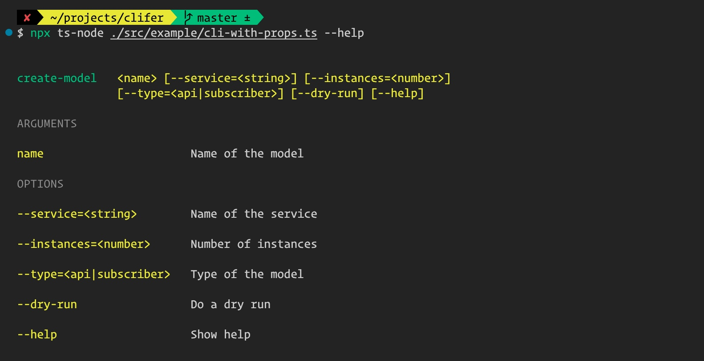
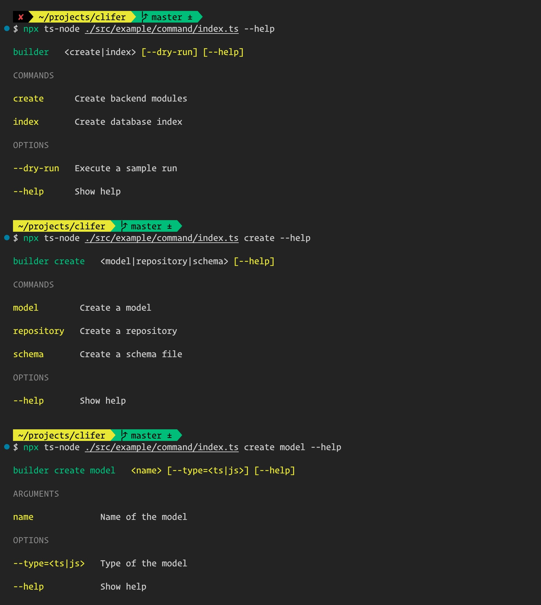

# clifer

[](https://github.com/semantic-release/semantic-release)

A light weight library for building beautiful command line interfaces for NodeJS applications

## Install

### Yarn

```sh
yarn add clifer
```

### NPM

```sh
npm install clifer
```

## Usage

```ts
import { cli, input, runCli } from 'clifer'

enum Type {
  api = 'api',
  subscriber = 'subscriber',
}

interface Props {
  service: string
  instances?: number
  type?: Type
  dryRun?: boolean
}

function run(props: Props) {
  // handle the action here
  console.log({ props })
}

const program = cli<Props>('create-model')
  // add an option '--version' to the version of the cli
  .version('1.0')

  // add a position input of type string and prompt if not passed on
  .argument(input('name').description('Name of the model').string().required().prompt())

  // add --service=<string>
  .option(input('service').description('Name of the service').string().required())

  // add --instances=<number>
  .option(input('instances').description('Number of instances').number().default(2))

  // add --type=[api|subscriber]
  .option(
    input('type').description('Type of the model').string().options([Type.api, Type.subscriber]),
  )

  // add --dry-run flag
  .option(input('dryRun').description('Do a dry run'))

  // handle the command
  .handle(run)

runCli(program).catch(e => console.error(e))
```

## Auto Generated Help



## Commands

```ts
import { cli, command, input, runCli } from 'clifer'

enum Type {
  ts = 'ts',
  js = 'js',
}

interface Props {
  dryRun?: boolean
}

interface CreateCommandProps {
  name: string
  type?: Type
}

interface IndexCommandProps {
  name: string
  publish?: boolean
}

const createModel = command<CreateCommandProps>('model')
  .description('Create a model')
  .argument(input('name').description('Name of the model').string().required())
  .option(input('type').description('Type of the model').string().options([Type.ts, Type.js]))
  .handle((props: CreateCommandProps) => {
    // handle action
  })

const createRepository = command<CreateCommandProps>('repository')
  .description('Create a repository')
  .argument(input('name').description('Name of the model').string().required())
  .option(input('type').description('Type of the model').string().options([Type.ts, Type.js]))
  .handle((props: CreateCommandProps) => {
    // handle action
  })

const createSchema = command<CreateCommandProps>('schema')
  .description('Create a schema file')
  .argument(input('name').description('Name of the model').string().required())
  .option(input('type').description('Type of the model').string().options([Type.ts, Type.js]))
  .handle((props: CreateCommandProps) => {
    // handle action
  })

const createCommand = command('create')
  .description('Create backend modules')
  .command(createModel)
  .command(createRepository)
  .command(createSchema)

const indexCommand = command<IndexCommandProps>('index')
  .description('Create database index')
  .argument(input('name').description('Name of the file to create').string().required())
  .option(input('publish').description('Should publish index'))
  .handle((props: IndexCommandProps) => {
    // handle action
  })

const program = cli<Props>('builder')
  .version('1.0')
  .command(createCommand)
  .command(indexCommand)
  .option(input('dryRun').description('Execute a sample run'))

runCli(program).catch((e: any) => console.error(e))
```



## Use prompt

```ts
import { input, prompt } from 'clifer'

// yes/no confirmation
const { overwrite } = await prompt(
  input('overwrite').description('Should overwrite?').prompt('Should overwrite?'),
)
console.log({ overwrite })

// string prompt
const { projectName } = await prompt(
  input('projectName')
    .description('Name of the project')
    .string()
    .prompt('What is the name of the project?'),
)
console.log({ projectName })

// string prompt with auto complete
const { environment } = await prompt(
  input('environment')
    .description('Environment')
    .string()
    .prompt('Enter environment')
    .choices(['local', 'dev', 'prod']),
)
console.log({ environment })

// number prompt
const { port } = await prompt(
  input('port').description('Server port').number().prompt('Enter port'),
)
console.log({ port })

// number prompt with choices
const { diskSize } = await prompt(
  input('diskSize')
    .description('Disk size to use the cloud')
    .number()
    .choices([10, 20, 50, 100])
    .prompt('Disk sizes (in GB)'),
)
console.log({ diskSize })

// multiple inputs together
const output = await prompt(
  input('firstName').description('First name').string().prompt(),
  input('lastName').description('Last name').string().prompt(),
  input('gender').description('Gender').string().choices(['Male', 'Female']).prompt(),
)
console.log(output)
```

## Automatic Release

Here is an example of the release type that will be done based on a commit messages:

| Commit message      | Release type          |
| ------------------- | --------------------- |
| fix: [comment]      | Patch Release         |
| feat: [comment]     | Minor Feature Release |
| perf: [comment]     | Major Feature Release |
| doc: [comment]      | No Release            |
| refactor: [comment] | No Release            |
| chore: [comment]    | No Release            |
