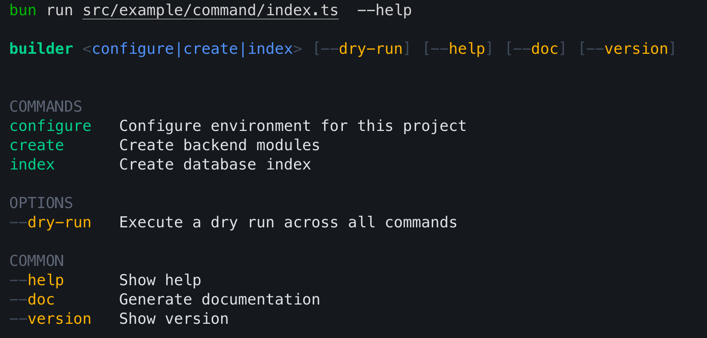

# Clifer

[](https://www.npmjs.com/package/clifer)
[](https://www.npmjs.com/package/clifer)
[](https://github.com/rintoj/clifer/blob/main/LICENSE)

A type-safe TypeScript framework for building beautiful command-line interfaces — with a fluent API, interactive prompts, and rich terminal UI powered by Ink and React.

## Features

- **Type-Safe** — Full TypeScript support with compile-time type checking
- **Fluent API** — Chainable, intuitive interface for building CLIs
- **Interactive Prompts** — Built-in support for user input, confirmations, and multi-select
- **Rich Terminal UI** — Ink-powered React components for beautiful output (cards, tables, spinners, and more)
- **Multi-Format Output** — Render as rich (default), plain text, or JSON with a single flag
- **Auto-Generated Help** — Beautiful help screens rendered with Ink, no extra configuration
- **Auto-Generated Docs** — Markdown documentation generated from your command definitions with `--doc`
- **Nested Commands** — Organize complex CLIs with deeply nested command structures
- **Async Config Loading** — Load configuration before argument parsing with `.load()`
- **Scaffolding CLI** — Bootstrap new CLI projects and add commands with `npx clifer init`

## Installation

```bash
npm install clifer
# or
yarn add clifer
# or
pnpm add clifer
# or
bun add clifer
```

## Quick Start

```typescript
import { cli, input, runCli } from 'clifer'

interface Props {
  name: string
  greeting?: string
}

const program = cli<Props>('greet')
  .version('1.0.0')
  .description('A friendly greeting CLI')
  .argument(input('name').description('Your name').string().required())
  .option(input('greeting').description('Custom greeting').string())
  .handle(async ({ name, greeting }) => {
    console.log(`${greeting ?? 'Hello'}, ${name}!`)
  })

runCli(program)
```

```bash
$ greet World
Hello, World!

$ greet World --greeting Hey
Hey, World!

$ greet --help

greet   <name> [--greeting=<string>] [--help] [--doc] [--version]

ARGUMENTS
  name                   Your name

OPTIONS
  --greeting=<string>    Custom greeting

COMMON
  --help                 Show help
  --doc                  Generate documentation
  --version              Show version
```

## Input Types

Clifer supports various input types with full TypeScript inference:

```typescript
// String
.option(input('name').description('Your name').string())

// Number with default
.option(input('port').description('Port number').number().default(3000))

// Boolean flag
.option(input('force').description('Force operation'))

// Single choice
.option(input('env').string().choices(['dev', 'staging', 'prod']))

// Multi choice (comma-separated via CLI, checkbox prompt interactively)
.option(input('languages').string().choices(['en', 'ml', 'fr']).many())
// CLI: --languages=en,ml  →  ['en', 'ml']

// Required argument
.argument(input('file').string().required())

// Custom validation
.option(input('email').string().validate(value => {
  if (!value.includes('@')) throw new Error('Invalid email')
  return value
}))
```

## Nested Commands

Build complex CLIs with nested command structures:

```typescript
import { cli, command, input, runCli } from 'clifer'

const addUser = command<{ name: string; email: string }>('add')
  .description('Add a new user')
  .argument(input('name').string().required())
  .argument(input('email').string().required())
  .handle(async ({ name, email }) => {
    console.log(`Adding user: ${name} (${email})`)
  })

const listUsers = command('list')
  .description('List all users')
  .option(input('format').string().choices(['json', 'table']).default('table'))
  .handle(async ({ format }) => {
    console.log(`Listing users in ${format} format`)
  })

const userCommand = command('user')
  .description('User management')
  .command(addUser)
  .command(listUsers)

const program = cli('myapp')
  .version('1.0.0')
  .command(userCommand)

runCli(program)
```

```bash
$ myapp user add "John Doe" john@example.com
$ myapp user list --format json
```

Help is automatically generated for every level of the command tree:



```bash
$ myapp --help

myapp   <user> [--help] [--doc] [--version]

COMMANDS
  user       User management

COMMON
  --help     Show help
  --doc      Generate documentation
  --version  Show version

$ myapp user --help

myapp user   <add|list> [--help] [--doc]

COMMANDS
  add    Add a new user
  list   List all users

COMMON
  --help   Show help
  --doc    Generate documentation
```

## Interactive Prompts

Create interactive CLI experiences with the `prompt()` function:

```typescript
import { cli, input, prompt, runCli } from 'clifer'

const program = cli('setup')
  .description('Interactive setup wizard')
  .handle(async () => {
    const config = await prompt(
      input('projectName').prompt('Project name?').string().required(),
      input('description').prompt('Description?').string(),
      input('typescript').prompt('Use TypeScript?').boolean(),
      input('framework')
        .prompt('Choose framework:')
        .string()
        .choices(['express', 'fastify', 'koa']),
    )
    console.log('Configuration:', config)
  })

runCli(program)
```

You can also attach prompts directly to arguments and options — they'll prompt interactively when the value isn't provided via the command line:

```typescript
const program = cli('deploy')
  .argument(
    input('environment')
      .string()
      .required()
      .prompt('Which environment?')
      .choices(['dev', 'staging', 'prod']),
  )
  .option(
    input('force')
      .prompt('Skip confirmation?'),
  )
  .handle(async ({ environment }) => {
    console.log(`Deploying to ${environment}...`)
  })
```

Prompt types are inferred automatically from the input configuration:

| Input Config                | Prompt Type    |
| --------------------------- | -------------- |
| `.boolean()`                | Confirm        |
| `.number()`                 | Numeral        |
| `.string().choices([...])`  | Autocomplete   |
| `.choices([...]).many()`    | Multi-select   |
| `.string()`                 | Text input     |

## Loading Configuration

Use `.load()` to fetch configuration asynchronously before argument parsing:

```typescript
import { cli, input, runCli } from 'clifer'
import { readFile } from 'fs/promises'

const program = cli<{ config?: string }>('myapp')
  .option(input('config').description('Config file path').string())
  .load(async (props) => {
    if (props.config) {
      const content = await readFile(props.config, 'utf-8')
      return JSON.parse(content)
    }
    return {}
  })
  .handle(async (props) => {
    console.log('Configuration loaded:', props)
  })

runCli(program)
```

## Custom Help Formatting

Override the default help output with a custom renderer:

```typescript
const program = cli('myapp')
  .version('1.0.0')
  .description('My application')
  .help(() => {
    return `
Custom Help Message
===================

Usage: myapp [options]

This is a custom help message with your own formatting.

Options:
  --help     Show this help message
  --version  Show version number
    `
  })
```

## Rich Terminal UI

Clifer includes a set of Ink-powered React components for rendering beautiful terminal output.

### Components

```typescript
import {
  Card,
  Message,
  Spinner,
  Heading,
  ErrorBox,
  StatusBadge,
  LabelValue,
  KeyValueTable,
  RichTable,
  renderOnce,
  theme,
} from 'clifer'
```

**Message** — Display success, error, info, or warning messages:

```typescript
renderOnce(<Message type="success">Deployment complete!</Message>)
renderOnce(<Message type="error">Build failed.</Message>)
renderOnce(<Message type="info">Checking for updates...</Message>)
renderOnce(<Message type="warning">Deprecated API detected.</Message>)
```

**Card** — Bordered card with an optional title:

```typescript
renderOnce(
  <Card title="Server Status">
    <LabelValue label="Status" value="Running" />
    <LabelValue label="Port" value="3000" />
    <LabelValue label="Uptime" value="2h 15m" />
  </Card>,
)
```

**Spinner** — Animated braille-pattern loading indicator:

```typescript
renderOnce(<Spinner label="Installing dependencies..." />)
```

**Heading** — Bold, primary-colored heading:

```typescript
renderOnce(<Heading>Deployment Summary</Heading>)
```

**ErrorBox** — Error container with cross symbol:

```typescript
renderOnce(<ErrorBox>Failed to connect to database.</ErrorBox>)
```

**StatusBadge** — Inline status indicator with predefined styles:

```typescript
renderOnce(<StatusBadge label="Build" value="active" />)
// Supported values: active, inactive, archived, completed, error, draft, published
```

**LabelValue** — Single label-value pair:

```typescript
renderOnce(<LabelValue label="Version" value="1.8.0" />)
```

**KeyValueTable** — Pretty-print an object as a key-value table:

```typescript
renderOnce(<KeyValueTable data={{ name: 'myapp', version: '1.0.0', port: 3000 }} />)
```

**RichTable** — Advanced table with column priority and pagination:

```typescript
renderOnce(
  <RichTable
    data={users}
    columns={['name', 'email', 'role']}
  />,
)
```

### Theme

All components use a consistent theme with colors and symbols:

```typescript
import { theme } from 'clifer'

// Colors
theme.colors.primary    // Blue
theme.colors.secondary  // Cyan
theme.colors.success    // Green
theme.colors.warning    // Yellow
theme.colors.error      // Red
theme.colors.muted      // Gray
theme.colors.label      // Cyan (labels)
theme.colors.value      // White (values)
theme.colors.border     // Gray (borders)
theme.colors.dim        // Dim gray

// Symbols
theme.symbols.bullet    // ●
theme.symbols.dash      // ─
theme.symbols.dot       // ·
theme.symbols.arrow     // →
theme.symbols.check     // ✓
theme.symbols.cross     // ✗
theme.symbols.ellipsis  // …
```

## Multi-Format Output

Every command supports three output modes out of the box via built-in flags:

| Flag     | Format | Use Case                          |
| -------- | ------ | --------------------------------- |
| _(none)_ | Rich   | Human-readable with colors & Ink  |
| `--text` | Plain  | Pipe-friendly, no colors          |
| `--json` | JSON   | Machine-readable, structured data |
| `--doc`  | Docs   | Auto-generated markdown documentation |

Use the `render()` function to support all three modes with a single call:

```typescript
import { render } from 'clifer'

const program = cli('status')
  .handle(async (props) => {
    const data = { status: 'running', port: 3000 }
    render(data, props, (data) => (
      <Card title="Server Status">
        <LabelValue label="Status" value={data.status} />
        <LabelValue label="Port" value={String(data.port)} />
      </Card>
    ))
  })
```

```bash
$ status              # Rich Ink output
$ status --text       # Plain text key-value pairs
$ status --json       # {"status":"running","port":3000}
$ status --doc        # Markdown documentation
```

### Output Utilities

For more control over output formatting:

```typescript
import {
  printJson,
  printText,
  printTextList,
  printMarkdown,
  formatAsTable,
  formatAsList,
  stripAnsi,
  getTerminalWidth,
  wrapText,
  renderInline,
} from 'clifer'

// Print structured data as JSON
printJson({ name: 'myapp', version: '1.0.0' })

// Print an object as formatted key-value pairs
printText({ name: 'myapp', version: '1.0.0', port: 3000 })

// Print an array as a formatted table
printTextList(users, ['name', 'email', 'role'])

// Render markdown with syntax-highlighted code blocks
printMarkdown('# Title\n\nSome **bold** text')

// Format data as a markdown table (returns string)
const table = formatAsTable([{ name: 'Alice', role: 'Admin' }])

// Format items as a markdown list table (returns string)
const list = formatAsList(items, ['name', 'value'])

// Strip ANSI escape codes from a string
const plain = stripAnsi(coloredString)

// Get current terminal width
const width = getTerminalWidth()

// Wrap text to a specific width
const wrapped = wrapText(longText, 80)

// Convert **bold** and *italic* markdown to ANSI codes
const styled = renderInline('This is **bold** and *italic*')
```

## Error Handling

Clifer provides two error classes for different scenarios:

```typescript
import { CliExpectedError, CliError } from 'clifer'

// CliExpectedError — for user-facing errors with clean output
// Displays the error message without a stack trace
throw new CliExpectedError('Invalid input. Expected a valid email address.')

// CliError — for runtime parsing errors (includes command context)
// Used internally by clifer during argument validation
```

Handle errors gracefully:

```typescript
const program = cli('deploy')
  .argument(input('environment').string().required())
  .handle(async ({ environment }) => {
    if (!['dev', 'staging', 'prod'].includes(environment)) {
      throw new CliExpectedError(
        `Invalid environment "${environment}". Use: dev, staging, or prod`,
      )
    }
    // Deploy logic...
  })

runCli(program).catch((error) => {
  if (error instanceof CliExpectedError) {
    console.error(`Error: ${error.message}`)
    process.exit(1)
  }
  throw error
})
```

## Built-in Flags

Every command automatically includes these flags:

| Flag        | Short | Description                                |
| ----------- | ----- | ------------------------------------------ |
| `--help`    | `-h`  | Show auto-generated help screen            |
| `--version` |       | Show version (when `.version()` is set)    |
| `--json`    |       | Output as JSON                             |
| `--text`    |       | Output as plain text                       |
| `--doc`     |       | Generate markdown documentation            |

## Help and Documentation

Help screens are automatically generated from your command definitions and rendered with Ink components. They include argument/option types, defaults, required indicators, and descriptions.

```bash
$ myapp --help        # Ink-rendered help screen
$ myapp user --help   # Help for a specific subcommand
$ myapp --doc         # Full markdown documentation
```

The `--doc` flag generates complete markdown documentation for your entire CLI, including all subcommands:

```markdown
# myapp

​```sh
myapp   <user> [--help] [--doc] [--version]

COMMANDS

  user       User management

COMMON

  --help     Show help
  --doc      Generate documentation
  --version  Show version
​```

## myapp user add

Add a new user

​```sh
myapp user add   <name> <email> [--help] [--doc]
​```

## myapp user list

List all users

​```sh
myapp user list   [--format=<json|table>] [--help] [--doc]
​```
```

### Help Format Reference

The help output uses these conventions:

| Notation          | Meaning                           |
| ----------------- | --------------------------------- |
| `<name>`          | Required argument                 |
| `[name]`          | Optional argument                 |
| `--flag`          | Boolean flag                      |
| `--opt=<string>`  | String option                     |
| `--opt=<number>`  | Number option                     |
| `--opt=<a\|b\|c>` | Choice option                    |
| `--opt=<a\|b>,...` | Multi-value choice (comma-separated) |
| `*`               | Required indicator (shown after option name) |

### Programmatic API

You can also use the help and documentation functions programmatically:

```typescript
import { showCliHelp, showDocumentation, showCliError, toHelp, toDocumentation } from 'clifer'

// Render Ink help screen for a command
showCliHelp(command, parentCommands)

// Generate and print markdown documentation
showDocumentation(command, parentCommands)

// Display a formatted error box
showCliError('Something went wrong', 'myapp deploy')

// Get help as a plain text string
const helpText = toHelp(command, prefix, includeCommonInputs)

// Get documentation as a markdown string array
const docs = toDocumentation(command)
```

## Scaffolding CLI

Clifer includes a scaffolding tool to bootstrap new projects:

```bash
# Create a new CLI project
npx clifer init my-cli-app

# Add a new command to an existing project
npx clifer command add my-command

# Add a nested subcommand
npx clifer command add parent/subcommand

# Remove a command
npx clifer command remove my-command
```

## Async Command Handlers

All handlers are async, enabling complex operations:

```typescript
const program = cli('fetch')
  .argument(input('url').string().required())
  .option(input('timeout').number().default(5000))
  .handle(async ({ url, timeout }) => {
    const controller = new AbortController()
    const timeoutId = setTimeout(() => controller.abort(), timeout)

    try {
      const response = await fetch(url, { signal: controller.signal })
      const data = await response.json()
      console.log(data)
    } catch (error) {
      if (error.name === 'AbortError') {
        throw new CliExpectedError(`Request timed out after ${timeout}ms`)
      }
      throw error
    } finally {
      clearTimeout(timeoutId)
    }
  })
```

## Complete Example

A full TODO CLI demonstrating commands, arguments, options, error handling, and nested structure:

```typescript
import { cli, command, input, runCli, CliExpectedError } from 'clifer'
import { readFileSync, writeFileSync, existsSync } from 'fs'

interface Todo {
  id: number
  text: string
  done: boolean
}

const TODO_FILE = './todos.json'

const loadTodos = (): Todo[] => {
  if (!existsSync(TODO_FILE)) return []
  return JSON.parse(readFileSync(TODO_FILE, 'utf-8'))
}

const saveTodos = (todos: Todo[]) => {
  writeFileSync(TODO_FILE, JSON.stringify(todos, null, 2))
}

const addCommand = command<{ text: string }>('add')
  .description('Add a new todo')
  .argument(input('text').string().required())
  .handle(({ text }) => {
    const todos = loadTodos()
    todos.push({ id: Date.now(), text, done: false })
    saveTodos(todos)
    console.log(`Added: "${text}"`)
  })

const listCommand = command<{ all?: boolean }>('list')
  .description('List todos')
  .option(input('all').description('Show completed todos'))
  .handle(({ all }) => {
    const todos = loadTodos()
    const filtered = all ? todos : todos.filter((t) => !t.done)

    if (filtered.length === 0) {
      console.log('No todos found.')
      return
    }

    filtered.forEach((todo) => {
      const status = todo.done ? '✓' : '○'
      console.log(`${status} [${todo.id}] ${todo.text}`)
    })
  })

const doneCommand = command<{ id: number }>('done')
  .description('Mark todo as done')
  .argument(input('id').number().required())
  .handle(({ id }) => {
    const todos = loadTodos()
    const todo = todos.find((t) => t.id === id)

    if (!todo) {
      throw new CliExpectedError(`Todo with id ${id} not found`)
    }

    todo.done = true
    saveTodos(todos)
    console.log(`Marked as done: "${todo.text}"`)
  })

const program = cli('todo')
  .version('1.0.0')
  .description('Simple TODO manager')
  .command(addCommand)
  .command(listCommand)
  .command(doneCommand)

runCli(program)
```

```bash
$ todo --help

todo   <add|list|done> [--help] [--doc] [--version]

Simple TODO manager

COMMANDS

  add    Add a new todo
  list   List todos
  done   Mark todo as done

COMMON

  --help      Show help
  --doc       Generate documentation
  --version   Show version

$ todo add "Buy groceries"
Added: "Buy groceries"

$ todo list
○ [1711234567890] Buy groceries

$ todo done 1711234567890
Marked as done: "Buy groceries"
```

### Real-World Example: Interactive Config with Async Loading

This example demonstrates `.load()` for async configuration, `.prompt()` for interactive inputs, choices, defaults, and mixed argument/option patterns:

```typescript
import { readFileSync, writeFileSync } from 'node:fs'
import { resolve } from 'node:path'
import { cli, input, runCli } from 'clifer'

interface Props {
  name?: string
  environment: string
  cloud?: string
  awsAccountId: string
  localPort?: number
}

const ENV_FILE = resolve(__dirname, 'env.json')

const program = cli<Props>('configure')
  .version('1.0.0')
  .description('Configure environment for this project')

  // Positional argument with interactive prompt
  .argument(input('name').description('Project name').string().prompt())

  // Required option with choices and default
  .option(
    input('environment')
      .description('Environment')
      .string()
      .required()
      .choices(['local', 'dev', 'prod'])
      .default('dev')
      .prompt(),
  )

  // Optional option with choices
  .option(
    input('cloud')
      .description('Cloud provider')
      .string()
      .choices(['aws', 'gcloud']),
  )

  // Option with interactive prompt
  .option(input('awsAccountId').description('AWS account id').string().prompt())

  // Number option with choices and prompt
  .option(
    input('localPort')
      .description('Local port')
      .number()
      .choices([4000, 4001, 4002])
      .prompt(),
  )

  // Load existing config before parsing arguments
  .load(async () => {
    try {
      return JSON.parse(readFileSync(ENV_FILE, 'utf-8'))
    } catch {
      return {}
    }
  })

  // Handle the command
  .handle(async (props) => {
    writeFileSync(ENV_FILE, JSON.stringify(props, null, 2), 'utf-8')
    console.log('Configuration saved!')
  })

runCli(program)
```

```bash
$ configure --help

configure   [name] --environment=<local|dev|prod> [--cloud=<aws|gcloud>]
[--aws-account-id=<string>] [--local-port=<4000|4001|4002>] [--help] [--doc]
[--version]

Configure environment for this project

ARGUMENTS

  name                                Project name

OPTIONS

  --environment=<local|dev|prod> *   Environment
  --cloud=<aws|gcloud>               Cloud provider
  --aws-account-id=<string>          AWS account id
  --local-port=<4000|4001|4002>      Local port

COMMON

  --help                              Show help
  --doc                               Generate documentation
  --version                           Show version

# Run with arguments
$ configure myapp --environment=prod --cloud=aws

# Run interactively (prompts for missing values)
$ configure
? Project name? _
? Environment? (dev/local/prod) _
? AWS account id? _
? Local port? (4000/4001/4002) _
Configuration saved!
```

## API Reference

### Core Functions

| Function            | Description                                  |
| ------------------- | -------------------------------------------- |
| `cli(name)`         | Create a new CLI program                     |
| `command(name)`     | Create a command or subcommand               |
| `input(name)`       | Create an input (argument or option)         |
| `runCli(program)`   | Execute the CLI with process arguments       |
| `prompt(...inputs)` | Prompt for multiple inputs interactively     |

### CLI / Command Builder

| Method              | Description                                       |
| ------------------- | ------------------------------------------------- |
| `.description(text)` | Set command description                          |
| `.version(string)`  | Set version and enable `--version` flag           |
| `.argument(input)`  | Add a positional argument                         |
| `.option(input)`    | Add a named option / flag                         |
| `.command(sub)`     | Add a subcommand                                  |
| `.load(asyncFn)`    | Async config loader, runs before argument parsing |
| `.handle(asyncFn)`  | Set the command handler                           |
| `.help(fn)`         | Override default help output                      |
| `.toCommand()`      | Convert builder to a Command object               |

### Input Builder

| Method               | Description                                           |
| -------------------- | ----------------------------------------------------- |
| `.string()`          | Define as string type                                 |
| `.number()`          | Define as number type                                 |
| `.boolean()`         | Define as boolean type                                |
| `.required()`        | Mark as required                                      |
| `.default(value)`    | Set default value                                     |
| `.choices(array)`    | Limit to specific choices                             |
| `.many()`            | Allow multiple values (comma-separated or checkboxes) |
| `.prompt(text?)`     | Enable interactive prompt when value is missing       |
| `.validate(fn)`      | Add custom validation                                 |
| `.description(text)` | Set description shown in help                         |
| `.toInput()`         | Convert builder to an Input object                    |

### Output & Rendering

| Function                        | Description                                 |
| ------------------------------- | ------------------------------------------- |
| `render(data, format, richFn)`  | Unified renderer (rich/text/json)           |
| `renderOnce(element)`           | Render an Ink component once and unmount    |
| `printJson(data)`               | Print data as JSON                          |
| `printText(data)`               | Print object as formatted key-value pairs   |
| `printTextList(items, fields?)` | Print array as formatted table              |
| `printMarkdown(content)`        | Render markdown with syntax highlighting    |
| `formatAsTable(data)`           | Format array as markdown table (returns string) |
| `formatAsList(items, fields?)`  | Format array as markdown list (returns string)  |
| `stripAnsi(str)`                | Remove ANSI escape codes from a string      |
| `getTerminalWidth()`            | Get current terminal width                  |
| `wrapText(text, width)`         | Wrap text to a specific width               |
| `renderInline(text)`            | Convert **bold**/*italic* to ANSI codes     |

### Help & Documentation

| Function                                     | Description                           |
| -------------------------------------------- | ------------------------------------- |
| `showCliHelp(command, parentCommands?)`       | Render Ink help screen for a command  |
| `showDocumentation(command, parentCommands?)` | Print markdown documentation          |
| `showCliError(message, commandText)`          | Display a formatted error box         |
| `toHelp(command, prefix?, includeCommon?)`    | Generate plain text help (returns string) |
| `toDocumentation(command)`                    | Generate markdown docs (returns string)   |

### UI Components

| Component       | Description                                                              |
| --------------- | ------------------------------------------------------------------------ |
| `Card`          | Bordered card with optional title                                        |
| `Message`       | Typed message — `success`, `error`, `info`, `warning`                    |
| `Spinner`       | Animated braille-pattern loading indicator with optional label            |
| `Heading`       | Bold, primary-colored heading                                            |
| `ErrorBox`      | Error container with cross symbol                                        |
| `StatusBadge`   | Status indicator — `active`, `inactive`, `archived`, `completed`, `error`, `draft`, `published` |
| `LabelValue`    | Single label-value pair                                                  |
| `KeyValueTable` | Pretty-print an object as key-value table                                |
| `RichTable`     | Advanced table with column priority and pagination                       |

### Utility Functions

| Function          | Description                                    |
| ----------------- | ---------------------------------------------- |
| `allInputs(cmd)`  | Extract all user-defined inputs from a command |
| `isCommand(obj)`  | Type guard for Command objects                 |
| `isInput(obj)`    | Type guard for Input objects                   |

### Types & Enums

```typescript
import type { Command, Input, FormatProps, OutputFormat } from 'clifer'
import { Kind, InputType } from 'clifer'

enum Kind {
  Command,
  Input,
}

enum InputType {
  String,
  Number,
  Boolean,
}

type OutputFormat = 'text' | 'json' | 'rich'
```

## Contributing

Contributions are welcome! Please open an issue first to discuss what you would like to change.

## License

MIT — see [LICENSE](LICENSE) for details.

## Links

- [GitHub Repository](https://github.com/rintoj/clifer)
- [npm Package](https://www.npmjs.com/package/clifer)
- [Issue Tracker](https://github.com/rintoj/clifer/issues)
